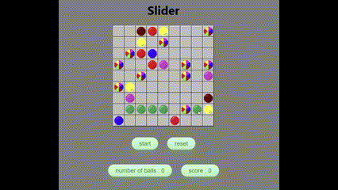

# Slider (Développement en cours...)

## Comment lancer le jeu

### Cloner le repository :
```bash
git clone https://github.com/felikarina/slider.git
```
### Lancer le fichier slider.html dans un navigateur.



Slider est une reproduction d'un jeu de logique du site Goobix. Le but est de marquer des points en alignant des boules de même couleur.

## Règles du jeu

- **Objectif :** Aligner au moins 5 boules de la même couleur, horizontalement, verticalement ou en oblique.
- **Déplacement :** Vous pouvez déplacer une boule vers un espace libre, à condition qu'il existe un chemin libre entre la position de départ et la destination.
- **Fin de partie :** Le jeu se termine lorsque toutes les cases sont remplies de boules.
- **Apparition de boules :** 3 nouvelles boules apparaissent aléatoirement après chaque mouvement ou après un clique sur le bouton start. Si vous réussissez à aligner correctement les boules, elles disparaissent et vous obtenez des points supplémentaires.
- **Boule "Joker" :** Elle peut remplacer n'importe quelle couleur.

## Avancement

### Fonctionnalités implémentées
- Boutons Start et Reset ✔️
- Apparition de trois boules de manière aléatoire ✔️
- Déplacement d'une boule ✔️
- Disparition d'une succession de 5 boules de même couleur horizontalement et verticalement ✔️
- Afficher le nombre de boules présentes en temps réel ✔️
- Afficher le score (10 points par alignement réussi) = bug parfois ajoute +20 points

### Fonctionnalités à implémenter
- Prendre en compte les alignements obliques
- Rendre le déplacement possible uniquement lorsqu'un chemin est disponible
- Gérer les boules "joker"
